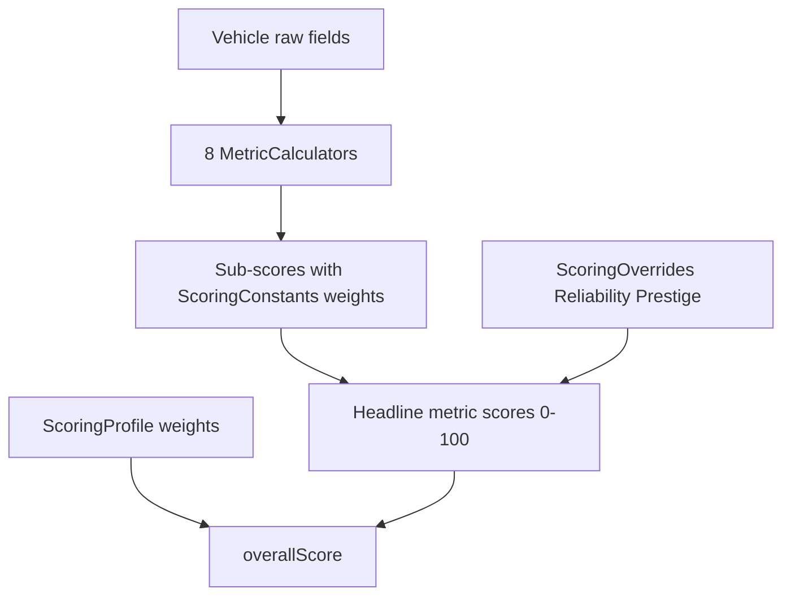

# Driver — Scoring Computation Specification

Detailed reference for how Driver calculates vehicle scores. This document mirrors the **implemented logic** in `za.driver.scoring` (not the high-level placeholders in [design_spec.md](design_spec.md)).

**Related documents:**

- [data_dictionary.md](data_dictionary.md) — canonical field definitions (dot-paths such as `safety.ncapStars`, `pricing.priceZar`)
- [design_spec.md](design_spec.md) — product goals and metric overview

**Source of truth in code:**

| Concern | File |
|---------|------|
| Primitives (scale, clamp, weighted average) | `src/main/java/za/driver/scoring/ScoreUtil.java` |
| Scale min/max and sub-metric weights | `src/main/java/za/driver/scoring/ScoringConstants.java` |
| Per-metric calculators | `src/main/java/za/driver/scoring/*Calculator.java` |
| Overall score and overrides | `src/main/java/za/driver/scoring/ScoringService.java`, `ScoringOverrides.java` |
| Default profile weights | `src/main/java/za/driver/service/DefaultProfileSeeder.java` |

---

## Overview

Driver produces **nine headline metrics**, each on a **0–100** scale, plus a weighted **overall score**. Each scoring profile selects **four top base metrics** and combines the remaining four into a **configurable aggregate metric** (default name: Awesomeness):

| Metric | Code enum | Calculator | Typical profile role |
|--------|-----------|------------|---------------------|
| Safety | `SAFETY` | `SafetyCalculator` | Top (Family default) |
| Running Cost | `RUNNING_COST` | `RunningCostCalculator` | Top (Family default) |
| Reliability | `RELIABILITY` | Heuristic + optional manual estimate (50/50 blend) | Top (Family default) |
| Comfort | `COMFORT` | `ComfortCalculator` | Aggregate component (Family default) |
| Performance | `PERFORMANCE` | `PerformanceCalculator` | Top (Family default) |
| Daily Driver | `DAILY_DRIVER` | `DailyDriverCalculator` | Aggregate component (Family default) |
| Technology | `TECHNOLOGY` | `TechnologyCalculator` | Aggregate component (Family default) |
| Prestige | `PRESTIGE` | Manual override only | Aggregate component (Family default) |
| Aggregate (`awesomenessScore`) | `AWESOMENESS` | `AwesomenessCalculator` (derived) | Aggregate slot (Family default) |

All computed outputs pass through `clamp(x) = min(100, max(0, x))`.

Scores are **never stored on the vehicle**; they are recalculated by `ScoringService` whenever vehicle data or the active profile changes.

---

## Core primitives

These building blocks are defined in `ScoreUtil`.

### Clamp

```text
clamp(x) = min(100, max(0, x))
```

### Linear scale

Higher raw values produce higher scores. Used when more is better (power, warranty years, seat count, etc.).

```text
linearScale(v, min, max) = clamp((v - min) / (max - min) × 100)
```

Returns `null` (sub-score excluded) when:

- The input value is missing (`null`), or
- `max ≤ min` (misconfigured scale)

### Inverse scale

Lower raw values produce higher scores. Used when less is better (fuel consumption, price, length, turning circle).

```text
inverseScale(v, min, max) = clamp((max - v) / (max - min) × 100)
```

Same exclusion rules as linear scale.

### Boolean sub-score

```text
booleanScore(true)  = 100
booleanScore(false) = 0
booleanScore(null)  = excluded (does not contribute weight)
```

A `false` value contributes **0** to the weighted average; it is not treated as missing.

### Sub-metric weighted average

Each headline metric combines sub-scores using weights from `ScoringConstants`:

```text
metricScore = Σ(subScoreᵢ × weightᵢ) / Σ(weightᵢ)
              for all i where subScoreᵢ ≠ null
```

Rules:

- Missing sub-scores (`null`) are **skipped** — their weights are not counted.
- Weights **renormalize** over available sub-scores only.
- If every sub-score is missing → headline metric is `null`.

---

## Global scale constants

Defined in `ScoringConstants.java`:

| Quantity | Field path | Min | Max | Used by |
|----------|------------|-----|-----|---------|
| Fuel consumption (L/100 km combined) | `economy.fuelConsumptionCombined` | 4 | 12 | Running Cost, Daily Driver |
| Warranty (years) | `ownership.warrantyYears` | 0 | 7 | Running Cost |
| Warranty (km) | `ownership.warrantyKm` | 0 | 200,000 | Running Cost |
| Service plan (years) | `ownership.servicePlanYears` | 0 | 5 | Running Cost |
| Service plan (km) | `ownership.servicePlanKm` | 0 | 100,000 | Running Cost |
| Maintenance plan (years) | `ownership.maintenancePlanYears` | 0 | 5 | Running Cost |
| Maintenance plan (km) | `ownership.maintenancePlanKm` | 0 | 120,000 | Running Cost |
| Tyre rim (inches, parsed) | `wheels.tyreSize` | 15 | 20 | Running Cost |
| Tyre section width (mm, parsed) | `wheels.tyreSize` | 185 | 255 | Running Cost |
| Seat count | `dimensions.seats` | 2 | 7 | Comfort |
| Wheelbase (mm) | `dimensions.wheelbaseMm` | 2,400 | 3,000 | Comfort |
| Turning circle (m) | `dimensions.turningCircleM` | 9 | 12.5 | Daily Driver |
| Length (mm) | `dimensions.lengthMm` | 4,000 | 5,000 | Daily Driver |

**Performance piecewise scales** (see Performance section): power-to-weight, torque-to-weight, and 0–100 km/h time use breakpoint arrays in `ScoringConstants`.

**Power-to-weight derivation** (Performance):

```text
powerToWeight = engine.powerKw / dimensions.kerbWeightKg × 1000
torqueToWeight = engine.torqueNm / dimensions.kerbWeightKg × 1000
```

Requires `engine.powerKw`, `engine.torqueNm`, and `dimensions.kerbWeightKg` **> 0**; otherwise Performance is `null`.

---

## Safety

**Calculator:** `SafetyCalculator`  
**Requires:** `vehicle.safety` object (otherwise metric is `null`).

Sub-metric weights sum to **100**.

| Sub-score | Field path(s) | Formula | Weight |
|-----------|---------------|---------|--------|
| NCAP | `safety.ncapStars` | `(ncapStars / 5) × 100` | 40 |
| Airbags | `safety.airbags` | `min(airbags, 10) / 10 × 100` | 15 |
| ABS | `safety.abs` | `booleanScore(abs)` | 5 |
| Stability | `safety.esp`, `safety.tractionControl` | See below | 10 |
| AEB | `safety.aeb` | `booleanScore(aeb)` | 10 |
| Lane assist | `safety.laneAssist` | `booleanScore(laneAssist)` | 8 |
| Blind spot | `safety.blindSpotMonitoring` | `booleanScore(blindSpotMonitoring)` | 7 |
| Rear cross-traffic | `safety.rearCrossTrafficAlert` | `booleanScore(rearCrossTrafficAlert)` | 5 |

**Stability sub-score logic:**

- If both `esp` and `tractionControl` are `null` → sub-score excluded.
- If at least one is non-null → score is **100** when either is `true`, otherwise **0**.

**Not included in Safety:** `safety.adaptiveCruiseControl` (scored under Technology).

---

## Running Cost

**Calculator:** `RunningCostCalculator`  
**Helpers:** `CoverageScoreUtil`, `TyreCostUtil`  
Sub-metric weights sum to **100**.

| Sub-score | Field path(s) | Formula | Weight |
|-----------|---------------|---------|--------|
| Fuel | `economy.fuelConsumptionCombined` | `inverseScale` (fuel min/max) | 30 |
| Warranty coverage | `ownership.warrantyYears`, `ownership.warrantyKm` | `coverageScore` (see below) | 15 |
| Service plan coverage | `ownership.servicePlanYears`, `ownership.servicePlanKm` | `coverageScore` | 12 |
| Maintenance plan coverage | `ownership.maintenancePlanYears`, `ownership.maintenancePlanKm` | `coverageScore` | 12 |
| Parts support | `ownership.partsSupportScore` | `clamp(score, 0, 100)` | 20 |
| Tyre cost | `wheels.tyreSize` | `TyreCostUtil.tyreCostScore` (derived) | 11 |

Each sub-score is included only when its source data is present. Missing sub-scores are excluded and weights renormalize.

**Not scored:** `pricing.priceZar`, `ownership.serviceIntervalKm`, `ownership.localProduction` (factual; informs manual `partsSupportScore` assignment).

### Coverage score (warranty, service plan, maintenance plan)

```text
yearsScore = linearScale(years, 0, yearsMax)
kmScore    = linearScale(km, 0, kmMax)
coverage   = average of non-null dimension scores
```

- Both years and km null → sub-score excluded.
- Only one dimension present → use that dimension at full value.

### Tyre cost score

Parse `wheels.tyreSize` (e.g. `215/60 R17`):

```text
rimScore   = inverseScale(rimInches, 15, 20)
widthScore = inverseScale(sectionWidth, 185, 255)
tyreCostScore = 0.75 × rimScore + 0.25 × widthScore   (when width parseable)
             = rimScore                               (when width missing)
```

Unparseable or null `tyreSize` → sub-score excluded.

---

## Comfort

**Calculator:** `ComfortCalculator`  
Sub-metric weights sum to **100**.

| Sub-score | Field path | Formula / scale | Weight |
|-----------|------------|-----------------|--------|
| Climate control | `features.climateControl` | `booleanScore` | 25 |
| Heated seats | `features.heatedSeats` | `booleanScore` | 20 |
| Electric seats | `features.electricSeats` | `booleanScore` | 15 |
| Seat count | `dimensions.seats` | `linearScale` (seats min/max) | 15 |
| Wheelbase | `dimensions.wheelbaseMm` | `linearScale` (wheelbase min/max) | 25 |

Boolean sub-scores require `vehicle.features`; numeric sub-scores require `vehicle.dimensions`.

---

## Performance

**Calculator:** `PerformanceCalculator`  
**Helper:** `PerformanceScoreUtil`  
Sub-metric weights sum to **100**. Uses **fixed weighting** (no renormalization when non-null).

| Sub-score | Field path(s) | Formula | Weight |
|-----------|---------------|---------|--------|
| Acceleration | `performance.zeroToHundredSeconds` or estimated from power-to-weight | `piecewiseLinear` on time (6/10/15 s → 100/50/0) | 40 |
| Power-to-weight | derived | `piecewiseLinear` on kW/t (50/80/120 → 0/50/100) | 30 |
| Torque-to-weight | derived | `piecewiseLinear` on Nm/t (80/150/250 → 0/50/100) | 20 |
| Transmission | `transmission.type` | Fixed scores (DCT 100, AUTO 80, MANUAL 70, CVT 60; missing → 70) | 10 |

**Mandatory inputs:** `engine.powerKw`, `engine.torqueNm`, `dimensions.kerbWeightKg` (> 0). If any missing → Performance is `null`.

**0–100 estimation** when `performance.zeroToHundredSeconds` is null:

```text
estimateZeroToHundred(powerToWeight) — piecewise map 50/80/120 kW/t → 15/10/6 s
```

---

## Daily Driver

**Calculator:** `DailyDriverCalculator`  
Sub-metric weights sum to **100**.

| Sub-score | Field path | Formula / scale | Weight |
|-----------|------------|-----------------|--------|
| Turning circle | `dimensions.turningCircleM` | `inverseScale` (turning circle min/max) | 25 |
| Length | `dimensions.lengthMm` | `inverseScale` (length min/max) | 25 |
| Fuel | `economy.fuelConsumptionCombined` | `inverseScale` (fuel min/max) | 25 |
| Parking aids | `features.parkingSensorsFront`, `features.parkingSensorsRear`, `features.reverseCamera` | Average of `booleanScore` over **non-null** features | 25 |

**Parking aids average:**

```text
parkingAidsScore = (Σ booleanScore(featureᵢ)) / count(non-null featuresᵢ)
```

If all three parking-aid fields are `null` → sub-score excluded.

---

## Technology

**Calculator:** `TechnologyCalculator`  
Sub-metric weights sum to **100**. All sub-scores use `booleanScore`.

| Sub-score | Field path | Weight |
|-----------|------------|--------|
| Android Auto | `features.androidAuto` | 12 |
| Apple CarPlay | `features.appleCarplay` | 12 |
| Reverse camera | `features.reverseCamera` | 12 |
| Digital cluster | `features.digitalCluster` | 12 |
| Wireless charging | `features.wirelessCharging` | 12 |
| Keyless entry | `features.keylessEntry` | 10 |
| Push-button start | `features.pushButtonStart` | 10 |
| Adaptive cruise | `safety.adaptiveCruiseControl` | 20 |

Feature booleans are read from `vehicle.features` except adaptive cruise, which is read from `vehicle.safety`.

---

## Reliability

**Calculator:** `ReliabilityCalculator`  
**Helpers:** `BrandReliabilityLookup`, `PowertrainReliabilityScorer`  
**Config:** `src/main/resources/config/brand-reliability.json`

Reputation-based estimate of dependability, repairability, and ease of ownership over 5–10 years. Does **not** predict failure rates.

### Formula

All three heuristic components are required; if any is missing → `reliabilityHeuristic = null`.

```text
reliabilityHeuristic = round(
  brandScore × 0.50 +
  powertrainScore × 0.20 +
  partsSupportScore × 0.30
)
clamp to [0, 100]
```

The headline **`reliabilityScore`** blends the heuristic with an optional manual estimate:

```text
When both present:
  reliabilityScore = round(0.50 × reliabilityHeuristic + 0.50 × reliabilityManualEstimate)

When only one present:
  reliabilityScore = that value (clamped to [0, 100])
```

| Component | Source | Weight |
|-----------|--------|--------|
| Brand | Brand reliability config lookup by `vehicle.make` | 50% |
| Powertrain | Derived from `engine.*`, `transmission.type` | 20% |
| Parts support | `ownership.partsSupportScore` (manual) | 30% |

`ownership.localProduction` is **not** scored (informs manual parts support assignment only).

### Brand lookup

Bundled defaults live in `src/main/resources/config/brand-reliability.json`. Users may override or extend brand entries via **Config → Brand Reliability…**, persisted to `data/brand-reliability-config.json`. User entries overlay bundled defaults at runtime.

Case-insensitive match on `vehicle.make`. Unknown brand → heuristic unavailable.

Each brand entry provides `reliability` (0–100) and `confidence` (0–100).

### Powertrain score

Base **75**, then stacked adjustments (clamp 0–100):

| Condition | Adjustment |
|-----------|------------|
| NA petrol | +10 |
| NA diesel | +8 |
| Turbo petrol / supercharged | -3 |
| Turbo diesel | +2 |
| Self-charging hybrid (not PHEV) | +3 |
| PHEV | -10 (skips aspiration/hybrid lines) |
| EV | +5 (skips aspiration/hybrid lines) |
| Manual | +5 |
| Automatic | +5 |
| CVT | -5 |
| DCT | -8 |

Missing transmission → no transmission adjustment. Missing engine fuel type **and** aspiration → powertrain unavailable.

### Confidence

`derivedMetrics.reliabilityConfidence` — computed from brand lookup only. **Never** influences the reliability score.

Display bands: 80–100 High, 50–79 Medium, 0–49 Low.

### Manual estimate

Optional per-vehicle estimate stored on `vehicle.manualScoreOverrides.reliabilityManualEstimate`. UI: **Reliability manual estimate** spinner. Blended 50/50 with the heuristic when both are set; otherwise the available value is used.

Legacy JSON field `reliabilityScore` under `manualScoreOverrides` is accepted via Jackson alias on import/load.

CSV column `manualScoreOverrides.reliabilityManualEstimate` round-trips on import/export. Export-only columns `derivedMetrics.reliabilityHeuristic` and `derivedMetrics.reliabilityScore` are ignored on import.

---

## Prestige (manual)

**Calculator:** `PrestigeCalculator` always returns `null`.

Set via `ScoringOverrides.prestigeScore` (UI: **Prestige override** spinner). Contributes to the profile aggregate metric when included in that profile's aggregate composition; does not participate in overall score directly.

---

## Aggregate metric (derived, stored as `awesomenessScore`)

**Calculator:** `AwesomenessCalculator` — weighted average of four component base metrics defined on the active `ScoringProfile`.

Each profile partitions the eight base metrics into:

- **Four top metrics** — weighted directly in the overall score via `ScoringProfile.weights`
- **Four aggregate components** — combined into one derived score (`derivedMetrics.awesomenessScore`) via `ScoringProfile.aggregateComponents`
- **One aggregate slot** (`Metric.AWESOMENESS`) — carries the aggregate's profile-level weight and a user-defined display name (`ScoringProfile.aggregateName`)

```text
awesomenessScore = weightedAverage(componentScores from aggregateComponents)
```

Uses the same renormalization rules as other weighted averages: missing component scores are excluded; if all four are null, `awesomenessScore = null`.

The aggregate score is **not** manually editable. Manual Prestige overrides affect the aggregate when Prestige is an aggregate component.

When `aggregateComponents` is absent (legacy JSON), the calculator falls back to the default composition below.

### Default aggregate composition (Family Focused)

| Component | Weight |
|-----------|--------|
| Prestige | 55% |
| Comfort | 15% |
| Daily Driver | 15% |
| Technology | 15% |

Legacy constant names (`AWESOMENESS_*_WEIGHT` in `ScoringConstants`) match these defaults and are used only as fallback.

---

## Overall score

Computed in `ScoringService.calculateOverall`:

```text
overallScore = Σ(metricScore × profileWeight) / Σ(profileWeight)
               for all metrics where metricScore ≠ null
```

Rules:

- Profile weights apply to the **five profile-level slots** (four chosen top base metrics plus the aggregate slot) with a **non-null** score.
- Weights **renormalize** over participating metrics — same pattern as sub-metric averages.
- If the profile is null, has no weights, or no metric scores exist → `overallScore = null`.
- Base metrics not chosen as top metrics do not participate in overall score directly; they feed the aggregate metric only.

### Default profile: Family Focused

Seeded by `DefaultProfileSeeder` (UUID `6ba7b810-9dad-11d1-80b4-00c04fd430c8`):

| Metric | Profile weight |
|--------|----------------|
| Safety | 25 |
| Running Cost | 15 |
| Reliability | 15 |
| Performance | 5 |
| Awesomeness (aggregate name) | 40 |
| **Total** | **100** |

Aggregate components (Comfort, Daily Driver, Technology, Prestige): 15%, 15%, 15%, 55% respectively.

The active profile is fully configurable via **Config → Manage Profiles…** or the toolbar profile selector (profile name, top-metric selection, aggregate name/weight, and aggregate composition). The active profile id is persisted in `data/app-config.json`. Legacy profiles with separate Comfort, Daily Driver, Technology, and Prestige profile weights are migrated automatically (their weights are summed into the aggregate slot). Profiles missing `aggregateName` or `aggregateComponents` are backfilled with `"Awesomeness"` and the default composition on load.

Additional profiles are stored as JSON in `data/profiles/{uuid}.json`.

---

## Score per R100k

Computed in `ScoringService` after the overall score:

```text
scorePer100k = overallScore / pricing.priceZar × 100_000
```

Rules:

- Returns `null` when `overallScore` or `pricing.priceZar` is missing, or when price ≤ 0.
- Not clamped — higher values indicate better score relative to price.
- Display label in the UI: **Score/R100k**.

---

## Worked example

Reference vehicle: `ScoringTestFixtures.fullVehicle()` — 2024 Toyota Corolla 1.8 XS (test fixture).

### Key inputs

| Field | Value |
|-------|-------|
| `safety.ncapStars` | 5 |
| `safety.airbags` | 7 |
| `safety.abs` | true |
| `safety.esp` | true |
| `safety.tractionControl` | true |
| `safety.aeb` | true |
| `safety.laneAssist` | true |
| `safety.blindSpotMonitoring` | false |
| `safety.rearCrossTrafficAlert` | true |
| `engine.powerKw` | 103 |
| `engine.torqueNm` | 173 |
| `dimensions.kerbWeightKg` | 1300 |
| `economy.fuelConsumptionCombined` | 6.5 |
| `ownership.warrantyYears` | 3 |
| `ownership.warrantyKm` | 100000 |
| `ownership.servicePlanYears` | 3 |
| `ownership.servicePlanKm` | 100000 |
| `ownership.partsSupportScore` | 90 |
| `wheels.tyreSize` | 195/60 R16 |
| `pricing.priceZar` | 350000 |
| `dimensions.seats` | 5 |
| `dimensions.wheelbaseMm` | 2700 |
| `dimensions.turningCircleM` | 10.8 |
| `dimensions.lengthMm` | 4630 |
| `features.parkingSensorsFront` | false |
| `features.parkingSensorsRear` | true |
| `features.reverseCamera` | true |
| `features.climateControl` | true |
| `features.heatedSeats` | false |
| `features.electricSeats` | false |
| `features.androidAuto` | true |
| `features.appleCarplay` | true |
| `features.digitalCluster` | false |
| `features.wirelessCharging` | false |
| `features.keylessEntry` | true |
| `features.pushButtonStart` | true |
| `safety.adaptiveCruiseControl` | true |

### Safety (step by step)

| Sub-score | Calculation | Score | × Weight |
|-----------|-------------|-------|----------|
| NCAP | (5 / 5) × 100 | 100 | 4000 |
| Airbags | min(7, 10) / 10 × 100 | 70 | 1050 |
| ABS | true | 100 | 500 |
| Stability | esp OR traction true | 100 | 1000 |
| AEB | true | 100 | 1000 |
| Lane assist | true | 100 | 800 |
| Blind spot | false | 0 | 0 |
| Rear cross-traffic | true | 100 | 500 |

```text
safetyScore = (4000 + 1050 + 500 + 1000 + 1000 + 800 + 0 + 500) / 100 = 88.5
```

### Performance (step by step)

| Sub-score | Calculation | Score | × Weight |
|-----------|-------------|-------|----------|
| Acceleration | est. 10.1 s from 79.2 kW/t → piecewise | 48.7 | 1948 |
| Power-to-weight | 79.2 kW/t → piecewise | 48.7 | 1461 |
| Torque-to-weight | 133.1 Nm/t → piecewise | 37.9 | 758 |
| Transmission | CVT | 60 | 600 |

```text
performanceScore = (1948 + 1461 + 758 + 600) / 100 = 47.67
```

### All headline metrics (Family Focused, no overrides)

Computed by `ScoringService` (verified against test fixture):

| Metric | Score |
|--------|-------|
| Safety | 88.50 |
| Running Cost | 72.89 |
| Reliability | null |
| Comfort | 46.50 |
| Performance | 47.67 |
| Daily Driver | 55.25 |
| Technology | 76.00 |
| Prestige | null |
| Awesomeness | 59.39 |

**Overall** (Reliability excluded; profile weights renormalize to 85):

```text
overallScore = (88.50×25 + 72.89×15 + 46.50×10 + 47.67×5 + 55.25×15 + 76.00×5 + 59.39×40) / 85
             ≈ 67.8
```

Note: overall score values in tests are authoritative; recompute after changing constants.

### With manual overrides

Overrides: Reliability = 90, Prestige = 50.

Awesomeness recomputes with Prestige at 55%; all five profile weights participate (total weight = 100):

```text
awesomenessScore = (50×55 + 46.50×15 + 55.25×15 + 76.00×15) / 100 = 54.55
overallScore = (88.50×25 + 72.89×15 + 90×15 + 47.67×5 + 54.55×40) / 100
```

### Missing data (renormalization)

`ScoringTestFixtures.partialVehicle()` (make/model only, no nested specs):

- Every auto calculator returns `null`.
- Reliability and Prestige remain `null` without overrides.
- **Overall score is `null`** — no metrics to weight.

If a profile assigns weight to Safety and Reliability but only Safety can be computed, overall renormalizes to Safety’s weight alone (see `ScoringServiceTest.calculate_renormalizesWeightsWhenSomeMetricsMissing`).

---

## Tuning guide

| What to change | Where |
|----------------|-------|
| Scale ranges (min/max) | `ScoringConstants` — `FUEL_MIN`, `POWER_MAX`, etc. |
| Sub-metric weights inside a headline metric | `ScoringConstants` — `SAFETY_NCAP_WEIGHT`, `TECH_ADAPTIVE_CRUISE_WEIGHT`, etc. |
| Which fields feed a metric | Individual `*Calculator.java` |
| Profile-level metric weights | `ScoringProfile` JSON in `data/profiles/` (**Config → Manage Profiles…**, toolbar selector) |
| Manual Reliability / Prestige per vehicle | Vehicle detail overrides → `ScoringOverrides` |

**Notes:**

- Changing `ScoringConstants` or calculators requires a **rebuild** (`mvn compile`).
- Profile weights are persisted JSON and take effect on next score recalculation.
- After changing constants, run `mvn test` — especially `src/test/java/za/driver/scoring/`.

---

## Computation flow


